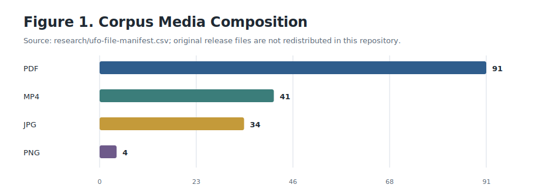
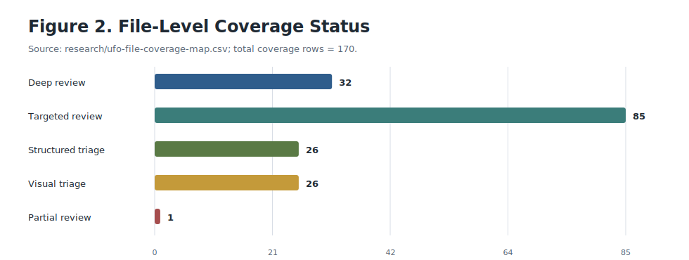
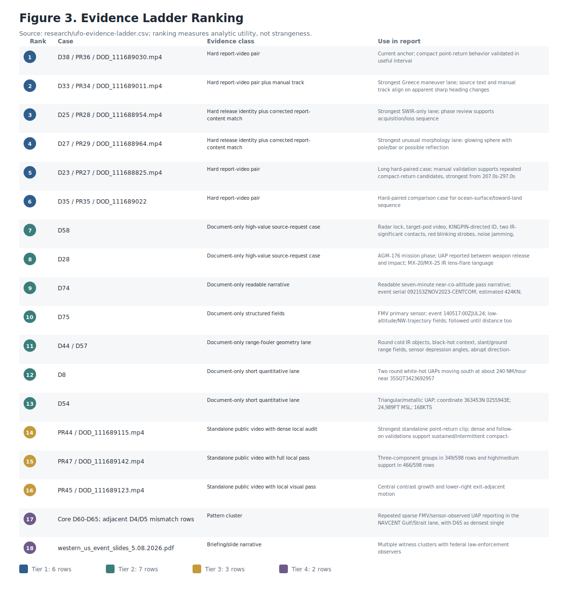
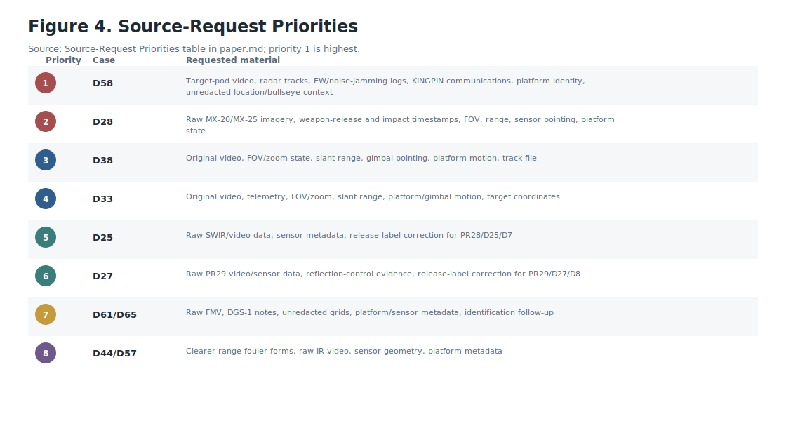
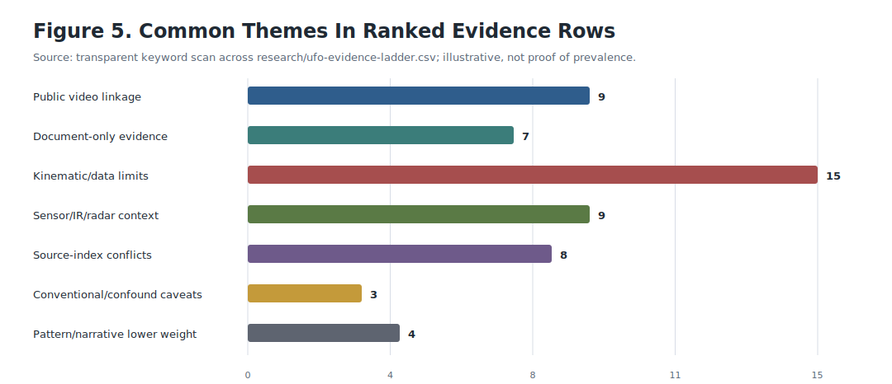

# Source-First Structured Assessment Of The UFO/UAP Release Corpus

Owner: Dan Fredriksen
Draft created: 2026-05-14
Source files: official public UFO/UAP release files, not redistributed in this repository
Report status: public release version, consistency checked; modern operational subset deeply reviewed, broader historical/image subsets covered by targeted triage

## Abstract

This report assesses a local corpus of `170` UFO/UAP-related files totaling approximately `4.24 GB`: `91` PDFs, `41` MP4 videos, `34` JPG images, and `4` PNG images. The corpus contains modern DoW/DoD mission reports and range-fouler records, public DoD video releases, recent briefing material, historical FBI/archive PDFs, NASA transcript and image material, State Department cables, and FBI photo sets.

Executive summary:
- The strongest evidence is in the modern operational subset, especially hard report/video pairings and tightly reconciled report-content/video lanes.
- The best-supported conclusion is unresolved operational observation, not non-human technology or independently reconstructed extraordinary physics.
- Release 02 broadens the corpus with a second 64-record tranche, but it mostly adds breadth, controls, and provenance structure rather than raising the claim ceiling.
- A new measurement-overlay exploitation lane identifies three positive meter-like display-annotation cases (`PR44`, `PR051`, and `PR059`) and compares them against selected controls and residual OCR triage without promoting any overlay to a physical size, range, speed, or acceleration claim.
- A derived-telemetry screening stack now captures report-derived fields, coordinate decodes, image-plane proxies, overlay candidates, ambiguity classes, and falsification tests; it rejects public-corpus overclaims while preserving unresolved and conventional explanation space where raw telemetry is absent.
- The recurring cross-corpus themes are over-water operational lanes, sensor-mode limitation, metadata hygiene, duplicate/control handling, and historical/archive context that strengthens interpretation but not the physics claims.
- The final draft is internally consistent and ready for external methodological review, with manual-review counts documented as descriptive acceptance counts rather than inferential statistics.

The strongest public evidence lanes are hard report/video pairings or strong report-content/video reconciliations, especially `D38/PR36/DOD_111689030.mp4`, `D33/PR34/DOD_111689011.mp4`, `D25/PR28/DOD_111688954.mp4`, `D27/PR29/DOD_111688964.mp4`, `D23/PR27/DOD_111688825.mp4`, and `D35/PR35/DOD_111689022`. Among the strongest document-only source-request targets are `D58`, `D28`, `D74`, `D75`, `D44/D57`, `D8`, and `D54`. Within that set, `D58` and `D28` carry the densest operational context. The strongest regional pattern lane is the Persian Gulf / Strait of Hormuz 2020 cluster, with `D61` as the strongest behavior row and `D65` as the densest single mission.

WAR.GOV published Release 02 on May 22, 2026, adding a second 64-record tranche to the live feed. This repository now includes tranche-specific Release 02 metadata, source-review, and video-review artifacts, and the report's core scientific conclusion is unchanged because the new tranche expands breadth without raising the claim ceiling.

The Release 02 video tranche has now been page-reviewed as a standalone release family. It contains 51 video entries, 8 digitally altered clips, one explicit duplicate pair (`PR057a` / `PR057b`), and one explicit non-duplicate same-title pair (`PR093` / `PR095`). No new hard local report pairing was confirmed from the tranche.

The remaining Release 02 non-video files have also been reviewed as a tranche. D017 is a historical green-fireball archive packet, ODNI-UAP-D001 is the strongest new narrative lane, DOE-UAP-D001 is the strongest image/provenance packet, DOE-UAP-D002 and DOE-UAP-D003 are historical context, and NASA-UAP-D008 through NASA-UAP-D014 are control/caveat material rather than new anomaly proof.

The historical archive PDFs and FBI photo set were additionally deep-sampled with OCR and contact-sheet review. That deeper pass confirmed the historical files preserve structured case language and the photo set remains low-context still imagery rather than an analyzable motion sequence.

The Western U.S. witness-summary lane adds narrative context rather than sensor proof: the slide deck summarizes four clusters, and the FBI composite sketch is a rendered witness-artifact composite rather than a raw photo. Taken together, they strengthen the witness-context side of the corpus without changing the physics ceiling.

Additional deep sampling of the modern structured-triage family sharpened the report-level distinctions without changing the claim ceiling. The April 2025 INDOPACOM email pair preserves two short unclassified tearlines with unknown altitude/speed and no interference; the March 2023 Pacific-time-zone record is a stronger narrative outlier with a large blue triangular object, perimeter lights, and erratic backing-up / jumping behavior; the August 2024 North American record is a long-duration oval/orb-shaped watch; and the November 2016 Syria mission report preserves an EO/IR contact with a ~500-knot estimate and mission-commander framing that fits possible missile or standard activity rather than a new physics claim.

The same deeper pass also strengthened the Persian Gulf / Strait of Hormuz cluster by recovering OCR details from the August, October, and July 2020 mission reports. Those reports preserve repeated UAP observation timings in the same theater, which makes them useful for regional pattern analysis and source-request prioritization even though the object descriptions remain partly redacted or OCR-limited.

The range-fouler family is now more coherent as well: `D56`, `D57`, and `D58` form a high-value sensor-context cluster around the North Arabian Sea and Gulf of Aden, with negative ES / radar / IFF signals, IR tracking, target-pod video, and noise-jamming effects that are useful for prioritization even though they still do not deliver calibrated reconstruction on their own.

The central scientific limitation is that public videos and redacted reports generally lack raw telemetry, sensor field of view, slant range, platform motion, gimbal pointing, exact coordinates, and frame-level metadata. Reported speeds, altitudes, object shapes, and maneuvers therefore often remain source-reported claims rather than independently reconstructable physical findings.

## Scope

The full local folder was inventoried. The deepest analysis focused on the modern DoW/DoD operational records and public DoD videos because they preserve the most probative fields: event times, mission context, sensor context, object descriptions, reported behavior, negative controls, and official release metadata.

**Scope box.** This paper distinguishes the local analyzed corpus from the live War.gov release manifest. The local corpus contains `170` files totaling approximately `4.24 GB`. The live War.gov manifest contains `222` release rows after Release 02. Release 02 is reviewed here as a tranche-level update, while the ranked evidence ladder remains anchored in the deeply reviewed local operational subset. The acquisition manifest hashes all `170` local files, but not every official release asset has an exact local filename match; those unmatched release assets are tracked separately in `research/ufo-source-acquisition-gaps.csv`.

The historical FBI/archive PDFs, NASA transcript and image material, State Department cables, and FBI photo sets were covered by targeted source-family triage. They were not exhaustively OCR-reviewed, photogrammetrically measured, or interpreted at the same depth as the modern operational subset. They should be treated as lower-priority context unless future source extraction promotes specific records into the main evidence ladder.

This distinction is important. The report's strongest findings concern the modern operational subset and public media releases, not every historical page or image in the broader folder.

Primary scope artifacts:

- `https://github.com/dfredriksen/ufo-uap-release-corpus-assessment/blob/main/research/ufo-file-manifest.csv`
- `https://github.com/dfredriksen/ufo-uap-release-corpus-assessment/blob/main/research/ufo-final-report-coverage-audit.md`
- `https://github.com/dfredriksen/ufo-uap-release-corpus-assessment/blob/main/research/ufo-file-coverage-map.csv`
- `https://github.com/dfredriksen/ufo-uap-release-corpus-assessment/blob/main/research/ufo-file-analysis-thread.md`
- `https://github.com/dfredriksen/ufo-uap-release-corpus-assessment/blob/main/research/war-gov-ufo-release-02-metadata-notes.md`
- `https://github.com/dfredriksen/ufo-uap-release-corpus-assessment/blob/main/research/ufo-release-02-synthesis.md`
- `https://github.com/dfredriksen/ufo-uap-release-corpus-assessment/blob/main/research/ufo-release-02-source-review.md`
- `https://github.com/dfredriksen/ufo-uap-release-corpus-assessment/blob/main/research/ufo-release-02-nonvideo-review.md`
- `https://github.com/dfredriksen/ufo-uap-release-corpus-assessment/blob/main/research/ufo-release-02-video-review.md`
- `https://github.com/dfredriksen/ufo-uap-release-corpus-assessment/blob/main/research/ufo-release-02-video-correlation-candidates.md`

## External Context

The corpus is interpreted in the same official public context used by the release program and the broader UAP reporting ecosystem:

- [WAR.GOV UFO Release 01](https://www.war.gov/UFO/)
- [WAR.GOV UFO Release 02](https://www.war.gov/UFO/?releaseDate=Release+02)
- [AARO UAP Records](https://www.aaro.mil/UAP-Records/)
- [NASA UAP](https://science.nasa.gov/uap/)
- [NASA UAP FAQs](https://science.nasa.gov/uap/faqs/)

These official pages establish public terminology, release context, and reporting pathways. They are context anchors, not independent validation of any specific case in the corpus.

## Method

The analysis used a conservative source-first method:

1. Inventory all source files without moving, renaming, or altering the originals.
2. Identify duplicate media and duplicate PDFs where exact same-size candidates existed.
3. Extract embedded PDF text where available.
4. Use OCR only on derived copies or page renders when embedded text was unavailable.
5. Reconcile local filenames, PDF text, War.gov source files, and DVIDS public release metadata.
6. Build video contact sheets and targeted visual passes for selected high-value public MP4s.
7. Separate source-reported claims from locally observed public-media behavior.
8. Rank evidence by provenance, source context, report/video linkage, visual support, and caveats.
9. Run targeted group-level triage for NASA/DOS, FBI photo, and historical/archive material where local extraction or high-resolution review was blocked by disk/read constraints.
10. Generate and validate publication figures from the manifest, coverage map, evidence ladder, source-request table, and transparent keyword scans.
11. Exploit visible measurement-like overlays as display annotations: classify positive cases, compare selected controls, run bounded residual OCR triage, and record source requests needed to resolve label semantics.
12. Apply derived-telemetry screening across report fields, coordinate decodes, image-plane measurements, range-geometry fields, and overlay candidates to separate what the public corpus can falsify from what still requires raw telemetry.
13. Prepare and archive publication-stage review packets and returned outputs: one for ChatGPT Pro to improve professional polish and consistency without strengthening unsupported claims, and one for Claude to provide critical methodological and evidentiary feedback. Both review passes are editorial QA, not independent evidence review.

The video work was intentionally bounded. Local visual review can support statements about image-plane features, compact returns, relative contrast, phase sequence, apparent image-plane turns, and visible release-description alignment. It cannot establish true object speed, altitude, range, physical trajectory, or acceleration without sensor geometry and platform data.

### Manual Review Protocol

The frame-level review used a conservative detector-centered rubric:

- A frame is accepted only when the candidate remains compact, visually separable from frame-edge, reticle, overlay, shoreline, terrain, or water-texture clutter, and remains usable across the local sampling step.
- The reported counts are descriptive acceptance counts from a single-analyst, unblinded pass, not inferential statistics or inter-rater estimates.
- The PR21/D14 two-area review is retained as a conventional comparator for the same compact-candidate logic; it stays terrain/texture-confounded and does not convert the comparator lane into anomaly proof.
- The PR27/D23 counts below should be read with the same rubric in mind: they are acceptance counts, not a significance test.

Primary methods artifacts:

- `https://github.com/dfredriksen/ufo-uap-release-corpus-assessment/blob/main/research/ufo-duplicate-candidates.csv`
- `https://github.com/dfredriksen/ufo-uap-release-corpus-assessment/blob/main/research/ufo-targeted-duplicate-summary.csv`
- `https://github.com/dfredriksen/ufo-uap-release-corpus-assessment/blob/main/research/ufo-video-dedupe-summary.md`
- `https://github.com/dfredriksen/ufo-uap-release-corpus-assessment/blob/main/research/ufo-report-video-correlation-matrix.md`
- `https://github.com/dfredriksen/ufo-uap-release-corpus-assessment/blob/main/research/ufo-evidence-ladder.md`
- `https://github.com/dfredriksen/ufo-uap-release-corpus-assessment/blob/main/research/ufo-nasa-dos-gap-triage.md`
- `https://github.com/dfredriksen/ufo-uap-release-corpus-assessment/blob/main/research/ufo-fbi-photo-gap-triage.md`
- `https://github.com/dfredriksen/ufo-uap-release-corpus-assessment/blob/main/research/ufo-historical-archive-gap-triage.md`
- `https://github.com/dfredriksen/ufo-uap-release-corpus-assessment/blob/main/research/ufo-overlay-measurement-completion-audit.md`
- `https://github.com/dfredriksen/ufo-uap-release-corpus-assessment/blob/main/research/ufo-overlay-measurement-classification.md`
- `https://github.com/dfredriksen/ufo-uap-release-corpus-assessment/blob/main/research/ufo-telemetry-recovery-methods.md`
- `https://github.com/dfredriksen/ufo-uap-release-corpus-assessment/blob/main/research/ufo-telemetry-evidence-inventory.md`
- `https://github.com/dfredriksen/ufo-uap-release-corpus-assessment/blob/main/research/ufo-telemetry-full-stack-application.md`
- `https://github.com/dfredriksen/ufo-uap-release-corpus-assessment/blob/main/research/ufo-telemetry-explanation-screening.md`
- `https://github.com/dfredriksen/ufo-uap-release-corpus-assessment/blob/main/figures/figure-validation.md`
- `https://github.com/dfredriksen/ufo-uap-release-corpus-assessment/blob/main/scripts/generate_publication_figures.py`
- `https://github.com/dfredriksen/ufo-uap-release-corpus-assessment/blob/main/review-packets/chatgpt-pro-touchup-packet.md`
- `https://github.com/dfredriksen/ufo-uap-release-corpus-assessment/blob/main/review-packets/chatgpt-pro-polished-paper.md`
- `https://github.com/dfredriksen/ufo-uap-release-corpus-assessment/blob/main/review-packets/claude-review-packet.md`
- `https://github.com/dfredriksen/ufo-uap-release-corpus-assessment/blob/main/review-packets/claude-review-output.md`

## Evidence Standard

This report uses four practical evidence tiers:

| Tier | Meaning | Examples |
|---|---|---|
| Tier 1 | Hard report/video pairings or strong report-content/video lanes with bounded visual analysis | `D38/PR36`, `D33/PR34`, `D25/PR28`, `D27/PR29`, `D23/PR27`, `D35/PR35` |
| Tier 2 | High-value document-only reports with strong operational context but no hard public video pairing | `D58`, `D28`, `D74`, `D75`, `D44/D57`, `D8`, `D54` |
| Tier 3 | Standalone public videos with useful local visual analysis but no written-report pairing | `PR44`, `PR47`, `PR45` |
| Tier 4 | Pattern, narrative, or lower-provenance lanes | Persian Gulf / Strait 2020 cluster, Western U.S. slide deck |

The ranking measures analytic utility, not strangeness. A case ranks higher when it preserves source identity, exact time, location, sensor context, report/video linkage, object behavior, negative controls, and a concrete source-request path. It ranks lower when it is redacted, unpaired, metadata-conflicted, reporter-derived only, visually ambiguous, or conventionally confounded.

## Claim Traceability

Machine-readable source: [research/ufo-claim-traceability.csv](research/ufo-claim-traceability.csv).

| Claim | Paper section | Support artifact | Claim type | Status |
|---|---|---|---|---|
| D38/PR36 supports compact point-return behavior | Finding 2 | `research/ufo-video-d38-anchor-notes.md` | Local image-plane observation | Not physical kinematics |
| D33/PR34 shows sharp image-plane turns | Finding 2 | `research/ufo-pr34-d33-manual-track-notes.md` | Local image-plane observation | Not physical kinematics |
| D25/PR28 is visually aligned with the SWIR-only sequence | Finding 2 | `research/ufo-video-pr28-d25-phase-review-notes.md` | Local image-plane observation | Key values remain report-derived |
| D58 is the top document-only source-request target | Finding 5 | `research/ufo-d58-evidence-packet.md` | Source-reported operational context | Needs raw data |
| D28 is the best weapons-context document-only case | Finding 6 | `research/ufo-d28-source-review.md` | Source-reported operational context | Needs raw imagery and timing |
| D61/D65 is a reporting-density lane, not a performance lane | Finding 7 | `research/ufo-persian-gulf-2020-timeline.md` | Pattern / narrative synthesis | Not kinematics |
| Public videos do not independently establish physical kinematics | Finding 3 | `research/ufo-pr34-d33-geometry-feasibility.md` | Methodological limitation | Telemetry and platform data required |
| Release 02 broadens breadth without raising the claim ceiling | Findings 10-12 | `research/ufo-release-02-synthesis.md` | Tranche-level synthesis | No hard new pairing |
| PR44/PR051/PR059 meter-like overlays are display annotations with unresolved semantics | Finding 13 | `research/ufo-overlay-measurement-classification.md` | Display-overlay observation | Not physical measurement |
| Residual overlay OCR triage found no new promoted meter-label cases | Finding 13 | `research/ufo-overlay-measurement-completion-audit.md` | Bounded OCR triage | No residual promotion under bounded triage |
| Overlay semantics require source documentation or raw metadata | Finding 13 | `research/ufo-overlay-measurement-source-requests.csv` | Methodological limitation | Falsifiable with source docs/raw telemetry |
| Public telemetry-like data rejects extraordinary-performance and origin overclaims | Finding 3 | `research/ufo-telemetry-explanation-screening.md` | Methodological limitation | Telemetry and platform data required |

## Figures

The figures below are generated from repository artifacts using `scripts/generate_publication_figures.py`. Validation checks are recorded in `figures/figure-validation.md`.

Figure 1 summarizes the `170` source files by media type: `91` PDFs, `41` MP4 videos, `34` JPG images, and `4` PNG images.

Figure 2 summarizes review coverage. No manifest row remains inventory-only; the largest bucket is targeted review for broader NASA/DOS, FBI photo, and historical/archive material.

Figure 3 visualizes the `18` ranked evidence-ladder rows. The ranking measures analytic utility and source quality, not strangeness.

Figure 4 shows the top raw-data/source-request priorities. The first two priorities, `D58` and `D28`, are document-only cases with dense operational context but insufficient public data for physical reconstruction.

Figure 5 is an author-curated keyword-frequency diagnostic across the `18` ranked evidence-ladder rows. It is retained as a theme audit, not as a prevalence estimate or real-world frequency measure.

A supplemental Release 02 theme summary is also generated in `figures/fig6-release-02-theme-summary.svg`. It emphasizes the second tranche's recurring over-water, historical/archive, control, duplicate-handling, and source-index hygiene themes without changing the report's claim ceiling.

## Principal Findings

### Finding 1: The Corpus Supports Unresolved Operational Reporting

The strongest finding is that official U.S. records in the release contain multiple structured reports of unresolved aerial or sensor observations in operational contexts. The best records include mission timing, supported unit, sensor type, aircraft/platform context, observation fields, weather or mission-effect fields, and explicit UAP/range-fouler language.

This is a significant finding, but it is not equivalent to a finding of non-human technology. The public record repeatedly withholds or redacts the data needed to test physical-performance claims.

Primary support:

- `https://github.com/dfredriksen/ufo-uap-release-corpus-assessment/blob/main/research/ufo-priority-incidents.md`
- `https://github.com/dfredriksen/ufo-uap-release-corpus-assessment/blob/main/research/ufo-modern-event-timeline.md`
- `https://github.com/dfredriksen/ufo-uap-release-corpus-assessment/blob/main/research/ufo-evidence-ladder.md`

### Finding 2: Hard Report/Video Pairings Exist

The release is not only a collection of disconnected reports and videos. Several public MP4s can be tied to official release pages and, in some cases, to stated accompanying reports.

The strongest hard anchor is `D38/PR36/DOD_111689030.mp4`. DVIDS explicitly pairs the public video with `DoW-UAP-D38`, and local visual review supports compact point-return behavior during the useful interval. This makes D38 the calibration case for the report.

Other strong public lanes include:

- `D33/PR34/DOD_111689011.mp4`: Greece ocean-surface maneuver lane. Manual tracking supports multiple sharp apparent image-plane heading changes, including `>=60` degree image-plane heading changes in the reviewed track, while true physical 90-degree turns and `80 MPH` remain report-derived.
- `D25/PR28/DOD_111688954.mp4`: Greece SWIR-only lane. The public video supports the SWIR acquisition/loss sequence, while `434 KNOTS`, size, altitude, and detailed shape remain report-derived.
- `D27/PR29/DOD_111688964.mp4`: UAE over-water unusual morphology lane. The public video aligns with the pole/bar or possible-reflection description, but the pole/bar may be a water reflection and the `140 KNOTS` value remains report-derived.
- `D23/PR27/DOD_111688825.mp4`: long hard-paired visual sequence. Manual validation supports repeated compact-return candidates, especially in the late loss/reacquisition interval: `144/181` reviewed late-interval frames were accepted as compact-return candidates versus `31/146` in the earlier comparison interval, using the conservative manual-validation rubric described above. These are descriptive counts, not significance-tested evidence of physical kinematics. The public video does not identify which D23 UAP row it depicts.
- `D35/PR35/DOD_111689022`: Greece ocean-surface control/comparison lane. The public clip supports the broad sequence, but clouds, shoreline, terrain, and the report's `NONE` maneuverability field limit its anomaly value.

Primary support:

- `https://github.com/dfredriksen/ufo-uap-release-corpus-assessment/blob/main/research/ufo-report-video-correlation-matrix.md`
- `https://github.com/dfredriksen/ufo-uap-release-corpus-assessment/blob/main/research/ufo-video-d38-anchor-notes.md`
- `https://github.com/dfredriksen/ufo-uap-release-corpus-assessment/blob/main/research/ufo-pr34-d33-manual-track-notes.md`
- `https://github.com/dfredriksen/ufo-uap-release-corpus-assessment/blob/main/research/ufo-video-pr28-d25-phase-review-notes.md`
- `https://github.com/dfredriksen/ufo-uap-release-corpus-assessment/blob/main/research/ufo-pr29-d27-visual-alignment.md`
- `https://github.com/dfredriksen/ufo-uap-release-corpus-assessment/blob/main/research/ufo-video-pr27-d23-manual-validation-notes.md`
- `https://github.com/dfredriksen/ufo-uap-release-corpus-assessment/blob/main/research/ufo-video-pr34-pr35-phase-review-notes.md`

### Finding 3: Public Videos Do Not Independently Establish Physical Kinematics

The reviewed videos are useful, but they generally do not contain the full sensor metadata needed for physical reconstruction. Public video review can detect or validate image-plane behavior, phase alignment, compact-return candidates, contrast persistence, or formation-like visual structure. It cannot independently convert those observations into real-world speed, altitude, range, acceleration, or physical turn geometry.

This is clearest in `D33/PR34`: local manual tracking supports multiple sharp apparent image-plane heading changes, including `>=60` degree image-plane changes, and geometry scenarios do not falsify the report's `80 MPH` value. But the same work also shows that actual FOV/zoom, slant range, platform motion, gimbal pointing, and telemetry are required before those image-plane turns can be treated as real physical maneuvers.

Primary support:

- `https://github.com/dfredriksen/ufo-uap-release-corpus-assessment/blob/main/research/ufo-pr34-d33-geometry-feasibility.md`
- `https://github.com/dfredriksen/ufo-uap-release-corpus-assessment/blob/main/research/ufo-video-d38-geometry-feasibility.md`
- `https://github.com/dfredriksen/ufo-uap-release-corpus-assessment/blob/main/research/ufo-pr29-geometry-feasibility.md`

### Finding 4: Several Source-Index Conflicts Are Real

The corpus contains official-source label and metadata conflicts. These conflicts must be preserved rather than smoothed over.

Key examples:

- DVIDS `PR29` says the accompanying report is `DoW-UAP-D8`, but local/War.gov `D8` is a separate Djibouti 2025 / Eastern Mediterranean-grid document-only case. The written-report content summarized by PR29 matches local/War.gov `D27`.
- DVIDS `PR28` says the accompanying report is `DoW-UAP-D7`, but local/War.gov `D7` is an Arabian Gulf 2020 balloon-like/TFLIR case. The written-report content summarized by PR28 matches local/War.gov `D25`.
- War.gov/local PDFs for `D56`, `D57`, and `D58` carry PDF metadata title/subject values resembling `DoW-UAP-D33`, `DoW-UAP-D34`, and `DoW-UAP-D35`, but those labels conflict with already-reviewed Greece lanes. These are best treated as metadata noise unless an official correction appears.

Primary support:

- `https://github.com/dfredriksen/ufo-uap-release-corpus-assessment/blob/main/research/ufo-pr29-d8-d27-reconciliation.md`
- `https://github.com/dfredriksen/ufo-uap-release-corpus-assessment/blob/main/research/ufo-pr28-d25-d7-reconciliation.md`
- `https://github.com/dfredriksen/ufo-uap-release-corpus-assessment/blob/main/research/ufo-range-fouler-official-metadata-check.md`

### Finding 5: D58 Is The Highest-Value Document-Only Source-Request Target

`D58` is the strongest unresolved document-only case in the range-fouler lane. It preserves radar lock, target-pod video, KINGPIN-directed identification, two IR-significant contacts, red blinking strobes, closest range `16.9 NM`, and noise-jamming language.

Those details are operationally important, but they also preserve strong conventional explanation space. Red blinking strobes, radar/target-pod context, jamming indications, and directed identification can fit military aircraft, drones, or electronic-warfare platforms. D58 should therefore be treated as a high-priority source-request case, not as a public proof-of-anomaly case.

Primary support:

- `https://github.com/dfredriksen/ufo-uap-release-corpus-assessment/blob/main/research/ufo-d58-evidence-packet.md`
- `https://github.com/dfredriksen/ufo-uap-release-corpus-assessment/blob/main/research/ufo-d58-evidence-constraints.csv`
- `https://github.com/dfredriksen/ufo-uap-release-corpus-assessment/blob/main/research/ufo-range-fouler-cluster-packet.md`

### Finding 6: D28 Is The Best Weapons-Context Document-Only Case

`D28` is important because the report body places the event in an Iraq / Ayn Al Asad / Operation Inherent Resolve context and describes a UAP during an AGM-176 weapons-employment sequence, with MX-20/MX-25 IR lens-flare language. The report is operationally narrow and source-request worthy.

The file's title/filename indicates East China Sea, but the body metadata is consistently USCENTCOM / Iraq-context. A release-index search found no hard public PR/video pairing for D28 or its unique anchors. The case remains document-only and cannot support public physical reconstruction without raw imagery and weapon timeline data.

Primary support:

- `https://github.com/dfredriksen/ufo-uap-release-corpus-assessment/blob/main/research/ufo-d28-source-review.md`
- `https://github.com/dfredriksen/ufo-uap-release-corpus-assessment/blob/main/research/ufo-d28-release-index-search.md`
- `https://github.com/dfredriksen/ufo-uap-release-corpus-assessment/blob/main/research/ufo-d28-evidence-packet.md`

### Finding 7: Persian Gulf / Strait 2020 Is A Reporting-Density Pattern, Not A Performance Lane

The core Persian Gulf / Strait of Hormuz 2020 cluster is `D60-D65`. `D4` and `D5` are adjacent but should not be treated as core Gulf/Strait rows because their readable full MGRS grids decode outside the Gulf/Strait lane despite Arabian Gulf filenames.

Inside the core `D60-D65` cluster:

- `D61` is the strongest behavior row. It reports a formation of unknown flying objects moving `NE-NW` along the coast, tracked for about two minutes before PID was lost in cloud cover.
- `D65` is the densest mission. It records three FMV UAP observations on `2020-07-16`, including one full observed-activity grid, `39RUN6234236874`, decoded locally to approximately `29.253233N, 49.583281E`.

This lane supports a regional reporting-density finding. It does not support object-level physical performance claims because the rows are sparse, redacted, and unpaired to public raw video or telemetry.

Primary support:

- `https://github.com/dfredriksen/ufo-uap-release-corpus-assessment/blob/main/research/ufo-persian-gulf-2020-timeline.md`
- `https://github.com/dfredriksen/ufo-uap-release-corpus-assessment/blob/main/research/ufo-d61-source-review.md`
- `https://github.com/dfredriksen/ufo-uap-release-corpus-assessment/blob/main/research/ufo-d65-source-review.md`

### Finding 8: The Corpus Contains Its Own Controls

The corpus is not a one-sided set of unexplained high-strangeness claims. It includes control and caveat records that point toward mundane or ambiguous explanations:

- possible birds and dust-limited FMV collection
- probable aircraft
- possible UAP/UAV ambiguity
- glare and halo artifacts
- balloon-like wind-traveling objects
- public videos with no written reporter description
- conventionally confounded military-platform signatures

These controls are scientifically valuable. They show that the release includes unresolved, ambiguous, and likely mundane lanes, and they reduce the risk of selection bias.

Primary support:

- `https://github.com/dfredriksen/ufo-uap-release-corpus-assessment/blob/main/research/ufo-evidence-ladder.md`
- `https://github.com/dfredriksen/ufo-uap-release-corpus-assessment/blob/main/research/ufo-report-video-correlation-matrix.md`
- `https://github.com/dfredriksen/ufo-uap-release-corpus-assessment/blob/main/research/ufo-priority-incidents.md`

### Finding 9: Historical And Static-Image Material Adds Breadth, Not Stronger Physics

The targeted NASA/DOS, FBI-photo, and historical/archive passes broaden the corpus but do not alter the evidence hierarchy.

NASA records add useful historical spaceflight context, especially Apollo 12, Gemini 7, Apollo 17, and Skylab material, but the strongest NASA lanes remain bounded by particles, booster or panel context, spacecraft debris/fragments, satellites, light-flash controls, and lack of calibration for independent object claims.

The FBI photo set covers `32` official records represented by `33` local files because `B6` appears both as a PDF and an extracted JPG. The A-series is low-context single still imagery with no location or mission report. The B-series has more context, but remains single-frame, redacted, and without reliable embedded image time. `B5` is a useful control-like frame with no distinct central object, while `B7` supplies an explicit conventional-appearance cue because the visible object is consistent with a helicopter.

The historical/archive PDFs confirm long-running official, military, FBI, diplomatic, and public interest in unusual aerial reports from World War II through the present. The best future OCR candidates are the `342` flying-discs file and the two `38_143685` incident-summary files, because they are most likely to preserve structured event fields. At current public-triage depth, however, they are not stronger than the modern operational report/video lanes.

Primary support:

- `https://github.com/dfredriksen/ufo-uap-release-corpus-assessment/blob/main/research/ufo-nasa-dos-gap-triage.md`
- `https://github.com/dfredriksen/ufo-uap-release-corpus-assessment/blob/main/research/ufo-fbi-photo-gap-triage.md`
- `https://github.com/dfredriksen/ufo-uap-release-corpus-assessment/blob/main/research/ufo-fbi-photo-record-index.csv`
- `https://github.com/dfredriksen/ufo-uap-release-corpus-assessment/blob/main/research/ufo-historical-archive-gap-triage.md`
- `https://github.com/dfredriksen/ufo-uap-release-corpus-assessment/blob/main/research/ufo-historical-archive-record-index.csv`

### Finding 10: Release 02 Broadens The Modern Video Tranche Without Raising The Claim Ceiling

WAR.GOV Release 02 adds a second `64`-record tranche to the live feed, including a large new Department of War video family plus a few high-signal document lanes. The strongest immediate Release 02 candidates are title-level triage targets such as `PR050`, `PR051`, `PR065`, `PR066`, `PR068`, `PR069`, `PR070`, `PR071`, `PR077`, `PR078`, `PR079`, `PR091`, `PR093`, `PR095`, and `PR098`, along with the non-video lanes `D017`, `CIA-UAP-D001`, `DOE-UAP-D001`, `NASA-UAP-D008`, and `ODNI-UAP-D001`.

These rows improve coverage and follow-up opportunities, but they do not by themselves change the report's claim ceiling. The tranche still lacks the raw telemetry, full sensor geometry, and report-to-video hard pairings needed to turn title-level candidates into physical reconstructions.

Primary support:

- `https://github.com/dfredriksen/ufo-uap-release-corpus-assessment/blob/main/research/war-gov-ufo-release-02-metadata-notes.md`
- `https://github.com/dfredriksen/ufo-uap-release-corpus-assessment/blob/main/research/ufo-release-02-synthesis.md`
- `https://github.com/dfredriksen/ufo-uap-release-corpus-assessment/blob/main/research/ufo-release-02-source-review.md`
- `https://github.com/dfredriksen/ufo-uap-release-corpus-assessment/blob/main/research/ufo-release-02-video-correlation-candidates.md`

### Finding 11: Release 02 Video Review Confirms A Standalone Release Family

The page-level review of the 51 Release 02 video rows shows that the tranche is useful as an internal release family and control set, not as a new source of confirmed hard report/video pairings.

The major publication-relevant takeaways are:

- 43 videos are not flagged as digitally altered in the page text; 8 are explicitly digitally altered.
- `PR057a` and `PR057b` are the only explicit duplicate pair in the tranche.
- `PR093` and `PR095` are explicitly not duplicates, even though they share the same uploader-defined title and highly similar subject matter.
- The tranche does not confirm a new hard local D-report linkage.
- The strongest operational value is as a tranche-level release-index family with internal controls, not as public kinematics proof.

Primary support:

- `research/ufo-release-02-video-review.md`
- `research/war-gov-ufo-release-02-video-review.csv`

### Finding 12: Release 02 Non-Video Review Is Historical And Control Heavy

The non-video Release 02 set broadens the corpus historically, but it does not raise the claim ceiling.

The key points are:

- `D017` is the strongest historical archive packet, centered on Sandia green-fireball reporting, Project Grudge correspondence, and 1948-1950 New Mexico sightings.
- `ODNI-UAP-D001` is the strongest new narrative lane because it preserves a detailed contemporary first-hand account tied to earlier infrared imagery.
- `DOE-UAP-D001` is a provenance-heavy image packet from Pantex and Sandia National Labs.
- `DOE-UAP-D002` and `DOE-UAP-D003` are historical context.
- `NASA-UAP-D008` through `NASA-UAP-D014` are control/caveat material: internal visual phenomena, likely mission debris or hardware, or non-UAP operational context.

The combined effect is to make the publication more complete and better balanced, not to add a new class of public proof.

Primary support:

- `research/ufo-release-02-nonvideo-review.md`
- `research/ufo-release-02-source-review.md`
- `research/ufo-nasa-dos-gap-triage.md`

### Finding 13: Measurement-Like Overlays Are Display Annotations, Not Physical Measurements

The overlay lane identifies three positive measurement-like display cases: `PR44`, `PR051`, and `PR059`. `PR44` contains a sustained reticle/track-box-associated `12M -> 11M -> 10M -> 9M` sequence. `PR051` contains repeated `5M` / `5m-style` labels in public excerpts and separate reticle-lock meter-like candidates. `PR059` contains a persistent target-adjacent `M` / `m` suffix sequence over a long interval.

These are valid public-frame observations, but they are not physical measurements. The public corpus does not include the display documentation, raw video, frame-level metadata, FOV/zoom state, range series, platform state, gimbal pointing, or chain-of-custody records needed to establish whether the labels encode object size, range, mode, magnification, track state, editing/replay state, or another display variable.

The lane also adds controls. Six selected control clips (`PR31`, `PR32`, `PR33`, `PR34`, `PR36`, and `PR45`) did not reproduce a PR44-style reticle-associated meter-label sequence under the current one-second survey geometry. Bounded residual triage did not promote any additional meter-label cases: Release 01 residual local OCR produced five candidate rows that manual review rejected as direction-marker, reticle, terrain/edge, or texture noise; Release 02 residual remote OCR produced eight candidate rows across six records that manual review rejected as terrain, field, shoreline, vessel/wake, reticle, direction-marker, display-geometry, or compression/contrast OCR noise.

This finding strengthens the report's source-first posture because it converts visually interesting overlay behavior into explicit source requests rather than unsupported physics claims.

Primary support:

- `research/ufo-overlay-measurement-classification.md`
- `research/ufo-overlay-measurement-completion-audit.md`
- `research/ufo-overlay-measurement-source-requests.csv`
- `research/ufo-overlay-measurement-residual-remote-review.md`

## Hypotheses And Falsification Tests

The overlay lane is best used as a hypothesis generator. The table below separates what the current public evidence supports from what would change the conclusion.

| Hypothesis | Current support | Falsification test | Required data | Current status |
|---|---|---|---|---|
| PR44/PR051/PR059 meter-like labels are real visible display annotations, not arbitrary OCR noise. | Manual label surveys and repeated frame-local visibility in the positive cases. | Independent blinded review or source-native frames show the apparent labels are compression, reticle, terrain, or replay artifacts. | Raw/native frames, independent annotation, display-layer export if available. | Not falsified; still semantically unresolved. |
| The PR44 sequence is reticle/track-box associated rather than a random display artifact. | PR44 surveys preserve a sustained `12M -> 11M -> 10M -> 9M` sequence spatially associated with the track/reticle geometry. | Source display layers or raw frame review show the labels are unrelated to the track/reticle state. | Native video, display-layer metadata, track-state logs. | Not falsified by selected controls. |
| PR051's `5M` / `5m-style` label is visible in public excerpts but chain-of-custody limited. | Repeated visibility in the acquired public MP4 and separate reticle-lock candidates. | Original source export shows the label was added only by editing, replay generation, or presentation processing. | Original source clip, chain-of-custody records, native export metadata. | Visible in public frames; source-chain unresolved. |
| Residual rows do not contain another promoted PR44/PR051/PR059-style case under the current bounded OCR method. | P1/P2/local/remote residual triage produced candidates but no promoted residual meter-label case. | Source-retained all-frame OCR/contact-sheet review finds a true meter-label sequence meeting the classification rule. | Source-retained MP4s, all-frame OCR, manual review, independent replication. | Supported only within the bounded method. |
| Public overlay labels alone prove physical size, range, speed, or acceleration. | No current support. | This claim would require source documentation tying labels to calibrated physical variables plus synchronized telemetry. | Display documentation, raw video, FOV/zoom state, range-time series, platform/gimbal state. | Rejected by current evidence. |
| Public telemetry-like data proves extraordinary performance or non-human origin. | No current support; the explanation-screening pass preserves conventional, sensor/display, source-index, and unresolved-operational families. | Raw calibrated sensor records validate real-world speed, acceleration, range, and trajectory while ruling out conventional, display, provenance, and artifact explanations. | Raw sensor video, frame metadata, FOV/zoom, range-time series, platform/gimbal state, radar/EW logs, and chain-of-custody records. | Rejected by current public evidence. |

## Evidence Ranking Summary

| Rank | Case | Evidence class | Use in this report |
|---:|---|---|---|
| 1 | `D38/PR36/DOD_111689030.mp4` | Hard report/video pair | Calibration anchor |
| 2 | `D33/PR34/DOD_111689011.mp4` | Hard pair plus manual track | Image-plane maneuver benchmark |
| 3 | `D25/PR28/DOD_111688954.mp4` | Hard release identity plus corrected report-content match | SWIR-only anomaly lane |
| 4 | `D27/PR29/DOD_111688964.mp4` | Hard release identity plus corrected report-content match | Unusual morphology / possible-reflection lane |
| 5 | `D23/PR27/DOD_111688825.mp4` | Hard report/video pair | Long compact-return sequence |
| 6 | `D35/PR35/DOD_111689022` | Hard report/video pair | Greece comparison/control lane |
| 7 | `D58` | High-value document-only | Radar/target-pod/jamming source-request target |
| 8 | `D28` | High-value document-only | Weapons-context sensor-event source-request target |
| 9 | `D74` | Document-only narrative | Best later readable narrative report |
| 10 | `D75` | Document-only structured fields | Gulf of Aden structured row with redacted description |
| 11 | `D44/D57` | Document-only geometry pair | Gulf of Aden IR range-fouler comparison |
| 12 | `D8` | Document-only short quantitative row | Djibouti-title / Eastern Mediterranean-grid mismatch |
| 13 | `D54` | Document-only short quantitative row | Aegean/Eastern Mediterranean sparse shape/speed/altitude row |
| 14 | `PR44/DOD_111689115.mp4` | Standalone video | Compact-return standalone benchmark |
| 15 | `PR47/DOD_111689142.mp4` | Standalone video | Formation-like standalone benchmark |
| 16 | `PR45/DOD_111689123.mp4` | Standalone video | Central-contrast growth lane |
| 17 | `D60-D65` cluster | Pattern lane | Persian Gulf / Strait 2020 reporting-density pattern |
| 18 | `western_us_event_slides_5.08.2026.pdf` | Briefing/witness narrative | Multi-cluster Western U.S. narrative summary: orange objects launching smaller red objects, a large fiery orange object near a rock pinnacle, a low dark-kite object with red/white lights, and a later transparent-kite object seen with NVGs or naked eye. |

## Interpretation

The best interpretation of the corpus is not that it reveals one phenomenon or one physical mechanism. It reveals multiple reporting lanes:

- operational mission reports with UAP fields
- range-fouler debriefs with sensor and mission context
- public videos with limited release metadata
- standalone public videos with no written reporter description
- source-index discrepancies between public pages, PDFs, and local filenames
- narrative and briefing artifacts
- targeted-reviewed historical, NASA/DOS, and static-image collections with lower scientific weight

The observed object descriptions vary widely: compact point returns, circular objects, diamond/probe descriptions, triangular/metallic descriptions, pole/bar or possible-reflection descriptions, cold IR objects, white-hot UAPs, formation language, balloon-like objects, glare/halo artifacts, and witness-narrative kite/orb descriptions. That variability argues against treating the corpus as one unified phenomenon at this stage.

The most defensible scientific claim is therefore narrow:

> The release contains multiple official operational records and public media items documenting reported unresolved aerial or sensor observations. The strongest cases justify source requests for raw data and release-index corrections. The public record does not justify a conclusion of non-human technology or independently reconstructed anomalous physics.

## Limitations

The following limitations are decisive:

1. Public videos lack the raw metadata needed for physical kinematics.
2. Reported speeds, shapes, altitudes, and behaviors are frequently source-reported rather than independently verified.
3. Many documents are redacted, OCR-noisy, or internally inconsistent.
4. Several public release labels conflict with local/War.gov report content.
5. Some apparently unusual visual features have plausible sensor, reflection, shoreline, cloud, water-texture, reticle, or compression explanations.
6. The historical FBI/NASA/DOS/image subsets have targeted triage coverage, but not exhaustive OCR, photogrammetry, or event-level reconstruction; they should not be used for stronger conclusions than their source quality supports.
7. Unresolved status is not evidence of extraordinary origin by itself.
8. The publicly released DVIDS video subset is a non-random selection from a larger operational archive. The frequency of any feature in the public-video subset should not be read as its frequency in the underlying operational corpus.
9. Public DVIDS clips are lossy-compressed and contain reticle, track-box, zoom, chroma, and luma artifacts. Apparent compact-return persistence, contrast growth, or formation-like structure must be evaluated against a codec-artifact floor before being treated as object behavior.
10. Manual video review is a single-analyst, unblinded process with no inter-rater reliability estimate or blinded control study. The counts reported for D33/D23 are descriptive acceptance counts, not inferential statistics.
11. ChatGPT Pro and Claude were used for editorial QA and methodological critique only. Their feedback improved wording, consistency, and limitation framing; it was not used as evidence and any suggestion that would strengthen unsupported claims was rejected.

## Competing Interests

Independent analysis. No funding. No affiliation with USG, AARO, or commercial UAP research organizations.

## Source-Request Priorities

The best next scientific step is acquisition of raw source data, not stronger interpretation of compressed public clips.

Priority requests:

| Priority | Case | Requested material |
|---:|---|---|
| 1 | `D58` | Target-pod video, radar tracks, EW/noise-jamming logs, KINGPIN communications, platform identity, unredacted location/bullseye context |
| 2 | `D28` | Raw MX-20/MX-25 imagery, weapon-release and impact timestamps, FOV, range, sensor pointing, platform state |
| 3 | `D38` | Original video, FOV/zoom state, slant range, gimbal pointing, platform motion, track file |
| 4 | `D33` | Original video, telemetry, FOV/zoom, slant range, platform/gimbal motion, target coordinates |
| 5 | `D25` | Raw SWIR/video data, sensor metadata, release-label correction for PR28/D25/D7 |
| 6 | `D27` | Raw PR29 video/sensor data, reflection-control evidence, release-label correction for PR29/D27/D8 |
| 7 | `D61/D65` | Raw FMV, DGS-1 notes, unredacted grids, platform/sensor metadata, identification follow-up |
| 8 | `D44/D57` | Clearer range-fouler forms, raw IR video, sensor geometry, platform metadata |

## Conclusion

The release is scientifically meaningful because it contains repeated official operational reports and public media releases involving unresolved aerial or sensor observations. The best cases are not proof of exotic technology. They are high-value records that preserve enough operational context to justify formal follow-up requests for raw sensor data, telemetry, and source-index corrections.

The current evidence supports a strong but bounded conclusion:

> There are credible unresolved observations in the corpus. The public evidence is insufficient to determine origin or extraordinary physical performance.

The most rigorous path forward is to preserve the evidence ladder, pursue raw data for the top source-request cases, and avoid converting redacted reports or compressed public videos into stronger claims than they can support.

## Supporting Artifacts

Core synthesis:

- `https://github.com/dfredriksen/ufo-uap-release-corpus-assessment/blob/main/research/ufo-evidence-ladder.md`
- `https://github.com/dfredriksen/ufo-uap-release-corpus-assessment/blob/main/research/ufo-priority-incidents.md`
- `https://github.com/dfredriksen/ufo-uap-release-corpus-assessment/blob/main/research/ufo-modern-event-timeline.md`
- `https://github.com/dfredriksen/ufo-uap-release-corpus-assessment/blob/main/research/ufo-report-video-correlation-matrix.md`
- `https://github.com/dfredriksen/ufo-uap-release-corpus-assessment/blob/main/research/ufo-final-report-coverage-audit.md`
- `https://github.com/dfredriksen/ufo-uap-release-corpus-assessment/blob/main/research/ufo-final-report-consistency-check.md`
- `https://github.com/dfredriksen/ufo-uap-release-corpus-assessment/blob/main/research/ufo-goal-completion-audit.md`
- `https://github.com/dfredriksen/ufo-uap-release-corpus-assessment/blob/main/figures/figure-validation.md`

Case packets and source reviews:

- `https://github.com/dfredriksen/ufo-uap-release-corpus-assessment/blob/main/research/ufo-d58-evidence-packet.md`
- `https://github.com/dfredriksen/ufo-uap-release-corpus-assessment/blob/main/research/ufo-d28-evidence-packet.md`
- `https://github.com/dfredriksen/ufo-uap-release-corpus-assessment/blob/main/research/ufo-d74-source-review.md`
- `https://github.com/dfredriksen/ufo-uap-release-corpus-assessment/blob/main/research/ufo-d75-source-review.md`
- `https://github.com/dfredriksen/ufo-uap-release-corpus-assessment/blob/main/research/ufo-d61-source-review.md`
- `https://github.com/dfredriksen/ufo-uap-release-corpus-assessment/blob/main/research/ufo-d65-source-review.md`
- `https://github.com/dfredriksen/ufo-uap-release-corpus-assessment/blob/main/research/ufo-d25-source-review.md`
- `https://github.com/dfredriksen/ufo-uap-release-corpus-assessment/blob/main/research/ufo-d27-source-review.md`
- `https://github.com/dfredriksen/ufo-uap-release-corpus-assessment/blob/main/research/ufo-d33-source-review.md`
- `https://github.com/dfredriksen/ufo-uap-release-corpus-assessment/blob/main/research/ufo-d35-source-review.md`
- `https://github.com/dfredriksen/ufo-uap-release-corpus-assessment/blob/main/research/ufo-d8-source-review.md`
- `https://github.com/dfredriksen/ufo-uap-release-corpus-assessment/blob/main/research/ufo-d54-source-review.md`

Video and geometry reviews:

- `https://github.com/dfredriksen/ufo-uap-release-corpus-assessment/blob/main/research/ufo-video-d38-anchor-notes.md`
- `https://github.com/dfredriksen/ufo-uap-release-corpus-assessment/blob/main/research/ufo-video-d38-geometry-feasibility.md`
- `https://github.com/dfredriksen/ufo-uap-release-corpus-assessment/blob/main/research/ufo-pr34-d33-manual-track-notes.md`
- `https://github.com/dfredriksen/ufo-uap-release-corpus-assessment/blob/main/research/ufo-pr34-d33-geometry-feasibility.md`
- `https://github.com/dfredriksen/ufo-uap-release-corpus-assessment/blob/main/research/ufo-video-pr27-d23-manual-validation-notes.md`
- `https://github.com/dfredriksen/ufo-uap-release-corpus-assessment/blob/main/research/ufo-video-pr28-d25-phase-review-notes.md`
- `https://github.com/dfredriksen/ufo-uap-release-corpus-assessment/blob/main/research/ufo-pr29-d27-visual-alignment.md`
- `https://github.com/dfredriksen/ufo-uap-release-corpus-assessment/blob/main/research/ufo-pr44-standalone-quant-notes.md`
- `https://github.com/dfredriksen/ufo-uap-release-corpus-assessment/blob/main/research/ufo-pr47-formation-visual-notes.md`
- `https://github.com/dfredriksen/ufo-uap-release-corpus-assessment/blob/main/research/ufo-pr45-standalone-visual-notes.md`

Source-index reconciliation:

- `https://github.com/dfredriksen/ufo-uap-release-corpus-assessment/blob/main/research/ufo-pr29-d8-d27-reconciliation.md`
- `https://github.com/dfredriksen/ufo-uap-release-corpus-assessment/blob/main/research/ufo-pr28-d25-d7-reconciliation.md`
- `https://github.com/dfredriksen/ufo-uap-release-corpus-assessment/blob/main/research/ufo-range-fouler-official-metadata-check.md`

Broader corpus triage:

- `https://github.com/dfredriksen/ufo-uap-release-corpus-assessment/blob/main/research/ufo-nasa-dos-gap-triage.md`
- `https://github.com/dfredriksen/ufo-uap-release-corpus-assessment/blob/main/research/ufo-fbi-photo-gap-triage.md`
- `https://github.com/dfredriksen/ufo-uap-release-corpus-assessment/blob/main/research/ufo-fbi-photo-record-index.csv`
- `https://github.com/dfredriksen/ufo-uap-release-corpus-assessment/blob/main/research/ufo-historical-archive-gap-triage.md`
- `https://github.com/dfredriksen/ufo-uap-release-corpus-assessment/blob/main/research/ufo-historical-archive-record-index.csv`

Telemetry and hypothesis-screening artifacts:

- `https://github.com/dfredriksen/ufo-uap-release-corpus-assessment/blob/main/research/ufo-forensic-telemetry-techniques.md`
- `https://github.com/dfredriksen/ufo-uap-release-corpus-assessment/blob/main/research/ufo-telemetry-recovery-methods.md`
- `https://github.com/dfredriksen/ufo-uap-release-corpus-assessment/blob/main/research/ufo-telemetry-evidence-inventory.md`
- `https://github.com/dfredriksen/ufo-uap-release-corpus-assessment/blob/main/research/ufo-telemetry-full-stack-application.md`
- `https://github.com/dfredriksen/ufo-uap-release-corpus-assessment/blob/main/research/ufo-telemetry-explanation-screening.md`

Publication figures:

- `https://github.com/dfredriksen/ufo-uap-release-corpus-assessment/blob/main/figures/fig1-corpus-media-composition.svg`
- `https://github.com/dfredriksen/ufo-uap-release-corpus-assessment/blob/main/figures/fig2-file-coverage-status.svg`
- `https://github.com/dfredriksen/ufo-uap-release-corpus-assessment/blob/main/figures/fig3-evidence-ladder-ranking.svg`
- `https://github.com/dfredriksen/ufo-uap-release-corpus-assessment/blob/main/figures/fig4-source-request-priorities.svg`
- `https://github.com/dfredriksen/ufo-uap-release-corpus-assessment/blob/main/figures/fig5-evidence-ladder-theme-frequency.svg`
- `https://github.com/dfredriksen/ufo-uap-release-corpus-assessment/blob/main/figures/theme-frequency.csv`
- `https://github.com/dfredriksen/ufo-uap-release-corpus-assessment/blob/main/figures/source-request-priorities.csv`
